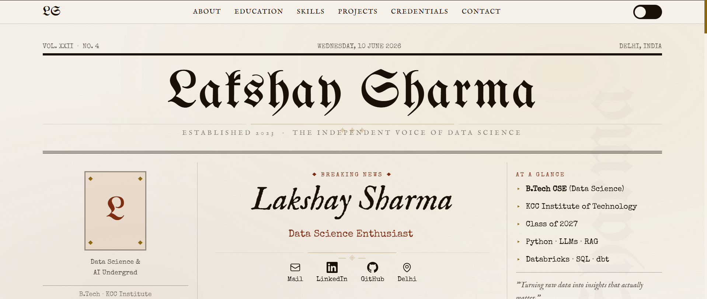
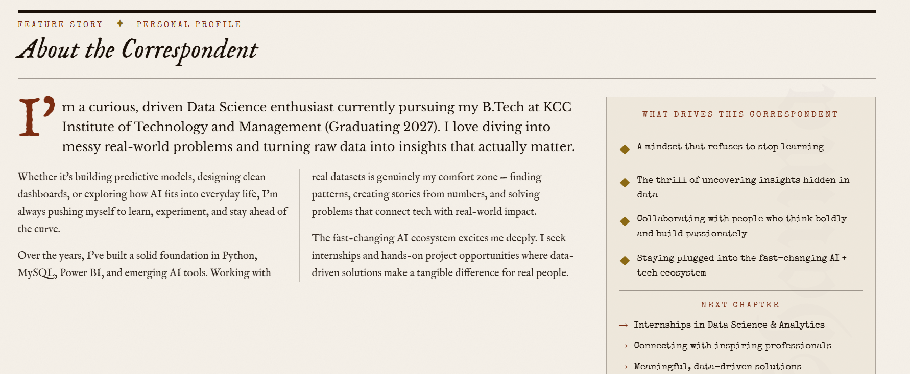
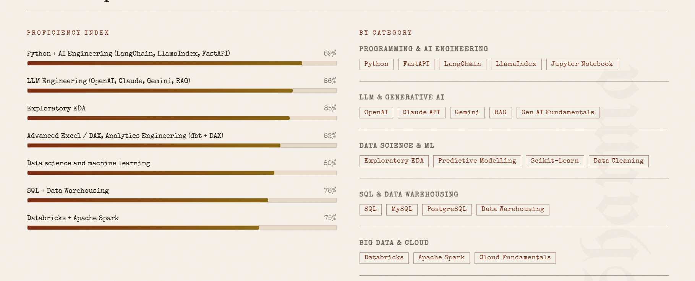
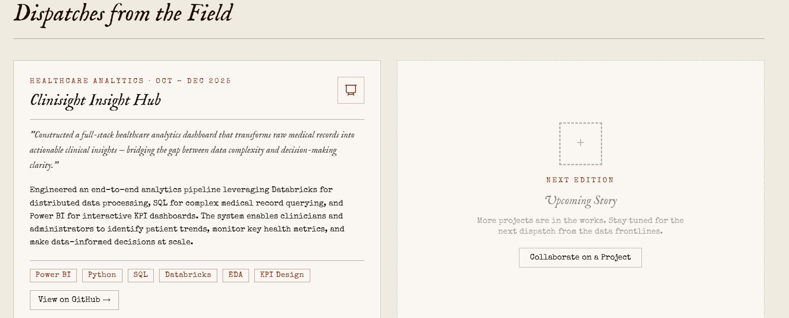

# 🚀 Day 10/60 — AB Talks AI Challenge

## Building My Personal Portfolio with AI

Today, I explored how AI can help create professional portfolio websites without spending hours on coding and design.

Instead of just learning new skills, I took a step toward showcasing them by building my own portfolio website.

---

## Portfolio Preview

### Homepage

About Me Section

Skills Section

Projects Section

Contact Section

[PASTE SCREENSHOT HERE]

---

## Key Learnings

* Personal branding is becoming increasingly important in the AI era.
* AI can significantly reduce the time required to create professional websites.
* A portfolio serves as a digital representation of your skills, projects, and achievements.
* Visibility creates opportunities by helping recruiters and professionals discover your work.
* Learning is valuable, but showcasing your work is equally important.

---

## Before vs After

### Before

* Focused mainly on learning new skills.
* Thought building a portfolio required extensive web development knowledge.
* Had limited online presence.

### After

* Understand the importance of personal branding.
* Built a professional portfolio using AI-assisted development.
* Created a platform to showcase projects, skills, and achievements.

---

### Challenge Progress

✅ Day 10 Completed
🎯 50 Days Remaining

#ABTalksAI #Day10 #ArtificialIntelligence #PortfolioWebsite #PersonalBranding #LearningInPublic
