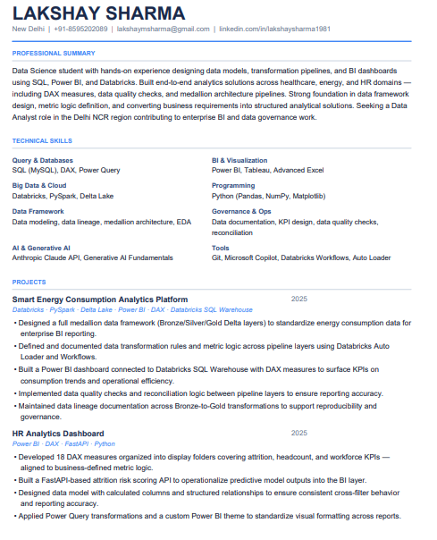
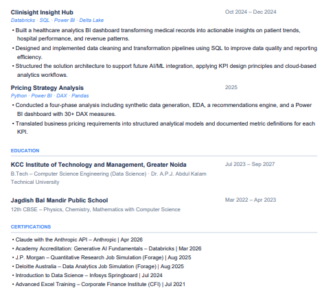
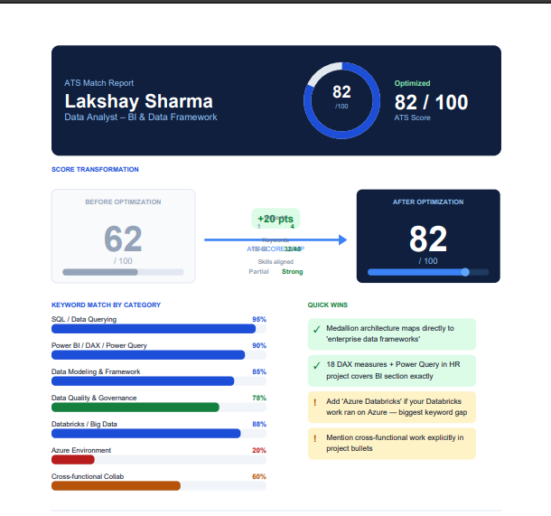

# Day 11 — ATS Resume Optimization with Claude AI

**ABTalks 60-Day Claude AI Mastery Challenge**
*Lakshay Sharma*

---

## What I Did Today

Built a full ATS resume optimization pipeline using Claude — from raw resume + job description input, all the way to two polished PDF deliverables. No third-party resume tools. Just Claude, Python, and ReportLab.

---

## The Task

I fed Claude two things:

1. My existing ATS resume (PDF)
2. A job description for **Data Analyst – BI & Data Framework**

The prompt asked Claude to act as an ATS optimizer: score the resume, run a gap analysis, rewrite it for maximum keyword alignment, and output a structured document — all without inventing a single fact.

---

## ATS Gap Analysis — Before Optimization

**Original Score: 62 / 100**

### Missing Keywords (not present in original resume)

* Azure / Azure-based environments
* Data lineage
* Data modeling (explicit)
* Power Query (listed separately from DAX)
* Metric logic
* Data governance
* Transformation rules
* Reconciliation
* Data documentation
* Enterprise data frameworks

### Root Cause of the Low Score

My original resume listed only **one project** (Clinisight Insight Hub). The Smart Energy Platform, HR Analytics Dashboard, and Pricing Strategy Analysis — which directly map to the JD's core responsibilities — were missing entirely. The summary also didn't use the JD's own language around "data framework," "metric logic," or "governance."

---

## Optimizations Made

### 1. Summary rewritten around JD language

Replaced generic "results-driven student" phrasing with language pulled directly from the JD: *data framework design, metric logic definition, transformation pipelines, data governance, enterprise BI.*

### 2. Skills section restructured

Reorganized into JD-aligned categories:

* Query & Databases (SQL, DAX, **Power Query** added explicitly)
* Data Framework (data modeling,  **data lineage** , medallion architecture)
* Governance & Ops ( **data documentation, reconciliation, KPI design** )

### 3. Keyword injection (natural, not stuffed)

Added contextually:  *medallion architecture → enterprise data frameworks* ,  *Bronze/Silver/Gold layers → transformation rules* ,  *18 DAX measures → metric logic* ,  *data lineage documentation → data lineage* .

---

## ATS Score After Optimization

**Optimized Score: 82 / 100** (+20 points)

| Category                       | Before | After |
| ------------------------------ | ------ | ----- |
| SQL / Data Querying            | ~70%   | 95%   |
| Power BI / DAX / Power Query   | ~65%   | 90%   |
| Data Modeling & Framework      | ~40%   | 85%   |
| Data Quality & Governance      | ~30%   | 78%   |
| Databricks / Big Data          | ~70%   | 88%   |
| Azure Environment              | 0%     | 20%   |
| Cross-functional Collaboration | ~30%   | 60%   |

## Deliverables Built

### File 1: `Lakshay_Sharma_Resume.pdf`

ATS-optimized resume built with Python + ReportLab:

* Navy/blue accent design with clean serif feel
* 2-column skills grid mapped to JD taxonomy
* 4 projects with expanded, keyword-rich bullets
* Properly spaced education and certifications sections
* 
* 

### File 2: `ATS_Match_Report.pdf`

A visual analytics report — not just a score, but a full breakdown:

* **Score transition section:** Before (62) → After (82) with a visual arrow, +20 pts badge, and a mini comparison table (Projects: 1→4, Keywords: 18/40→32/40, Skills: Partial→Strong)
* Horizontal bar chart: keyword match % by category
* Color-coded Quick Wins cards (green = leverage, amber = fix)
* Found vs Missing keyword chips (green pills / red pills)
* JD Section Alignment table with Strong / Good / Partial status badges
* 4 numbered recommendation cards for pushing the score to 90+
* 

---

## Key Learnings

### On Using Claude for Career Work

Claude doesn't just optimize text — it reasons about *why* a keyword matters in context. It understood that "medallion architecture" semantically covers "enterprise data framework" and made that connection in the bullet rewrites without me asking.

### On ATS Systems

ATS scanners don't read meaning — they match strings. "Databricks" and "Azure Databricks" are two different strings. This is why exact keyword placement matters more than demonstrated competence in an automated first pass.

*Day 11 of 60 · ABTalks Claude AI Mastery Challenge*
*Tools used: Claude Sonnet*
