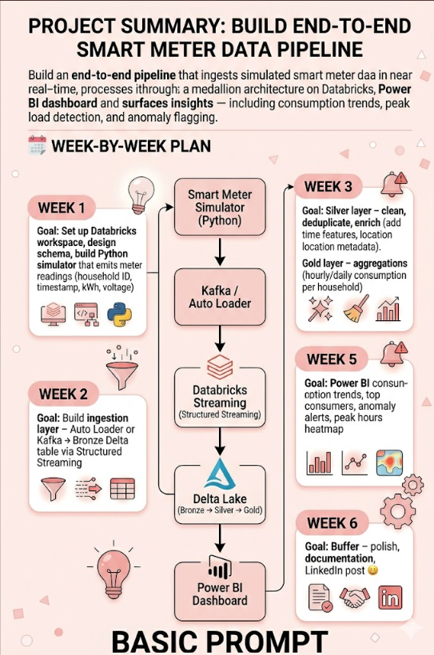
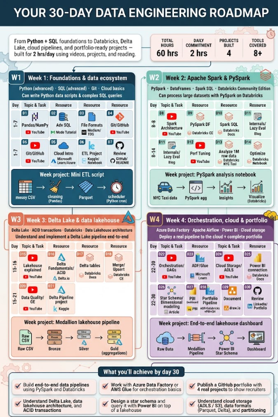

# Context Engineering 

*A Comparative Study of Basic vs. Contextualized Prompts | Organized by AB Talks*

**DAY 5/60 CHALLENGE**

---

## 1. Executive Summary

In modern generative AI workflows, the phrasing of an operational prompt often matters significantly less than the structural metadata environment wrapping it. This laboratory document details the outcomes, simulated visual architectures, and systemic findings generated during the Day 5 challenge. By comparing a standard single-intent prompt against an engineered contextual grid for an identical end product (a Data Engineering Roadmap), we establish objective performance deltas in precision, customizability, and operational feasibility.

---

## 2. Side-by-Side Output & Asset Comparison

The experiment contrasted an unstructured baseline query against a highly dimensional prompt carrying temporal limits, dynamic metrics, explicitly mapped curriculum resources, and project-based gates.

### Asset A: Basic Prompt Variant

> *"Create a light pink/white data pipeline diagram roadmap."*

Yields a strictly linear, highly summarized conceptual overview. The layout models data flow abstractions rather than executable action.

```
Smart Meter Sim (Python)
        ⬇
Kafka / Auto Loader Ingestion
        ⬇
Databricks Medallion (B → S → G)
        ⬇
Power BI Dashboard Analytics
```

*Characteristics: Horizontal block sequence, minimal micro-scheduling, single project focus.*

---

### Asset B: Context-Engineered Variant

> *"Build roadmap with constraints: 30 days, 2 hrs/day, 4 projects, 8+ tools, exact resource links..."*

Yields a matrix-style vertical timeline layout with nested operational milestones, time-boxed constraints, and multi-asset trackers.

| ⏱ 60 Total Hrs | 2 Hrs/Day | 4 Projects | 🛠 8+ Tools |
| --------------- | --------- | ---------- | ----------- |

**W1: Foundations & Git Ecosystem**

- D1–D2: Advanced SQL & Pandas Refresher (Keith Galli, Mode)
- D6–D7: Project Day — Messy CSV to Cleaned Parquet Script

**W2–W3: PySpark & Medallion Lakehouse**

- Ingest to Bronze → Clean in Silver → Aggregate in Gold Tables

**W4: Cloud Orchestration & Power BI Dashboard**

- ADF Pipeline + Star Schema Dimensional Modeling

---

## 3. Key Engineering Learnings & System Mechanics

Analyzing the qualitative and structural execution gaps between the two modules reveals four foundational pillars of Context Engineering:

1. **Personalized Outputs via Constraint Hardening:** Absent context, the AI defaults to mathematical averages — generating high-level boilerplate material. Injecting hard human boundaries (e.g., 2 hours per day, free tier community tools) transforms the system into an environment optimizer, ensuring the output matches individual logistical realities.
2. **Elimination of Assumption Cycles (Higher Accuracy):** Basic prompts force the LLM to complete missing information by guessing parameters. Providing target domains, source URLs (e.g., Microsoft Learn, Kimball methodology documentation), and data formats prevents hallucinated sequences and builds technical correctness directly into the compilation.
3. **Multi-Tier Operational Planning:** Context engineering changes how timelines are calculated. Instead of a linear list of tasks, the system stacks foundational skills, links them sequentially to progressive weekly milestones, and aligns final outputs with direct portfolio assets.
4. **Parallels with Production-Grade Autonomous Agents:** Within enterprise environments, independent AI agents do not run on pure instruction sets. They operate inside automated data frameworks that systematically retrieve semantic historical state, identify current workflow parameters, utilize temporary memory stores, and apply system guardrails. Prompting without context ignores the structural realities of modern enterprise AI architecture.

---

> 💡 **Core Takeaway for Technical Workflows**
>
> The performance ceiling of an AI-driven workflow is directly determined by the quality and structure of its input framework. To consistently achieve enterprise-grade results, engineering efforts must shift from semantic prompt phrasing toward creating comprehensive, data-rich context models.

---

## 4. Visual Outputs from Bot Prompts

Below are the visual outputs generated by the bot prompts described in the side-by-side comparison:

### Asset A: Basic Prompt Variant Output

This diagram represents the output generated using the basic prompt:



### Asset B: Context-Engineered Variant Output

This roadmap represents the output generated using the context-engineered prompt:


