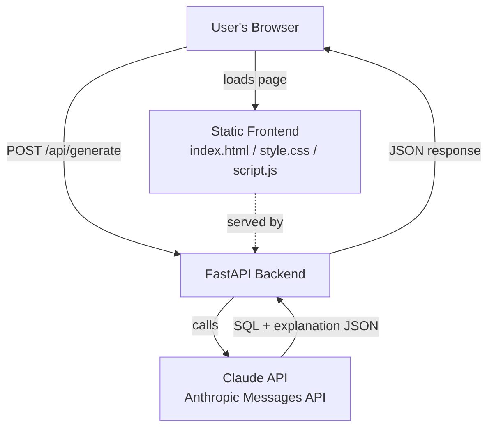
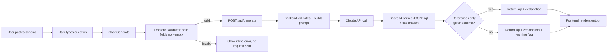
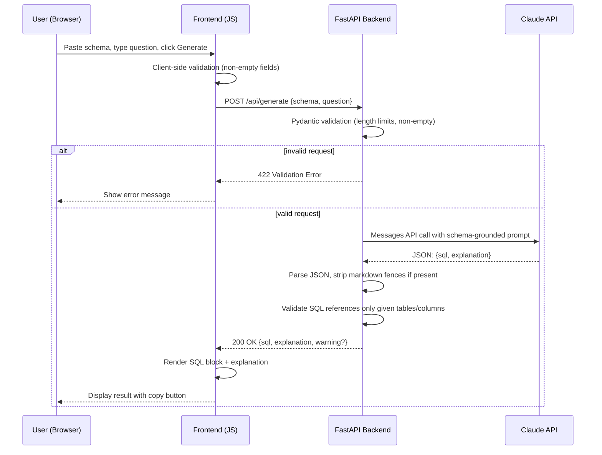

# ARCHITECTURE.md — QueryMind

## 1. Tech Stack (Finalized)

| Layer | Choice | Why |
|---|---|---|
| Frontend | Hand-built HTML/CSS/JS (vanilla, no framework) | Full styling control for the polished UI priority from the PRD; no build tooling needed, keeps daily 1-hour sessions simple; served directly as static files by the backend. |
| Backend | Python + **FastAPI** | Builder already knows Python; FastAPI has automatic request validation (Pydantic), auto-generated docs at `/docs` for free manual testing, async support, and is free/open-source. |
| Server | **Uvicorn** | Standard ASGI server for FastAPI, minimal config. |
| Database | **None** | PRD explicitly excludes accounts, history, and persistence. The app is stateless — every request is self-contained (schema + question in, SQL + explanation out). Adding a DB would violate the "no unnecessary scope" rule. |
| Authentication | **None** | PRD explicitly excludes login (Scope Out, item: "User accounts, authentication"). |
| AI Model/API | **⚠️ CHANGED Day 54: Groq API** (Llama 3.3 70B, OpenAI-compatible chat completions) — was: Claude API | On Day 54, the builder's Anthropic account had no usable credit balance (no free trial available, and adding paid credits was explicitly ruled out), so the Claude API could not be called at all. After evaluating a local Ollama model (ruled out — limited disk space) and a paid Anthropic top-up (ruled out — no card), **Groq** was chosen as the only option satisfying both real constraints: $0 cost, no card, no local disk usage (it's a hosted cloud API, just like Claude, only free). **Explicitly noting for transparency:** this project's core AI feature is no longer powered by Claude specifically, despite being built for the Claude AI Challenge — a fully informed tradeoff made after Claude access proved genuinely blocked by account credits, not by choice. |
| Hosting | **Render (Free Web Service tier)** | Free, deploys directly from a GitHub repo (supports a "Root Directory" setting so we can point it at `Day 52/querymind` without needing a separate repo), supports environment variables for the API key, and runs Python/Uvicorn natively. |
| Other libraries | `anthropic` (official Python SDK), `python-dotenv` (local env vars), `pydantic` (bundled with FastAPI, request/response validation) | All free, minimal, and match the "no new stack to learn" constraint. |

### Architecture improvement over the original Day 2 blueprint sketch
The original blueprint implied a separate frontend/backend running on different ports (flagging CORS as a "common issue"). Today we simplify: **FastAPI serves the static frontend files directly** (via `StaticFiles`), so frontend and backend are one deployed service. This eliminates CORS entirely and means only one Render service needs to be configured on Day 9 instead of two. This does not change scope or the PRD — it's a pure implementation simplification, so no approval gate is needed, but flagging it here for the record.

---

## 2. Component Diagram

**Components:**
- **Static Frontend** — served by the backend itself, no separate hosting needed.
- **FastAPI Backend** — one process, two responsibilities: serve static files, and expose `POST /api/generate`.
- **Claude API** — the only external service. Called once per user request, no state kept between calls.

---

## 3. Data Flow

---

## 4. Request Lifecycle (Sequence Diagram)

---

## 5. AI Interaction Detail

**Updated Day 54 — Groq (Llama 3.3 70B), not Claude — see table above for why:**
- **Model:** `llama-3.3-70b-versatile` via the Groq API (`groq` Python SDK, OpenAI-compatible chat completions).
- **Prompt strategy:** system prompt instructs the model to act as a SQL expert, use ONLY the tables/columns in the pasted schema, and respond with strict JSON (`{"sql": "...", "explanation": "..."}`) — same approach as originally planned for Claude.
- **Statelessness:** unchanged — each request is independent, no history sent or stored.
- **Post-processing:** the backend extracts the first valid JSON object from the response text (handles accidental markdown fences or stray text) before returning it to the frontend.
- **Verified Day 54:** tested against multiple schemas (single-table, multi-table joins, aggregation + `LIMIT`) — all produced correct, well-formed SQL with clear explanations.

---

## 6. External Services

| Service | Purpose | Cost |
|---|---|---|
| Groq API (was: Anthropic Claude API — changed Day 54, see AI Model/API row above) | Core SQL generation + explanation | Free tier, no card required |
| Render (Free Web Service) | Hosting the deployed app | Free tier |
| GitHub | Source control (existing repo) | Free |

No other external services, databases, or third-party integrations are required for v1.0.
