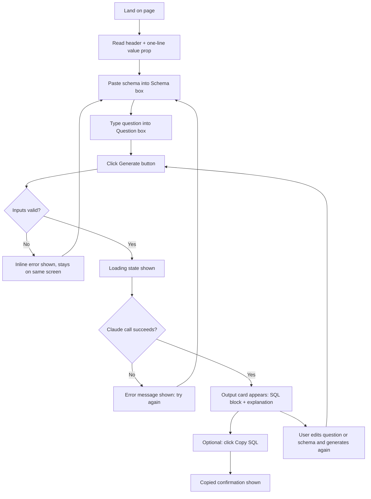

# UI-WIREFRAMES.md — QueryMind

## 1. User Flow Diagram



This confirms there is exactly **one screen** — every state (empty, loading, error, result) is a state of the same page, not a new screen. This matches the PRD's single-shot, no-navigation design.

---

## 2. Screen Inventory (every screen exists for a reason)

| Screen/State | Reason it exists |
|---|---|
| Empty state (initial load) | First impression — must clearly communicate what the tool does in one glance |
| Filled/ready state | User has entered input, "Generate" is enabled |
| Loading state | Claude API calls take a few seconds — user needs feedback it's working |
| Result state | The core value delivery — SQL + explanation displayed clearly |
| Error state (validation) | Prevents wasted API calls, guides user to fix input |
| Error state (API failure) | Handles real-world failures gracefully instead of a blank crash |

There is **no** separate "about" page, settings page, or navigation menu — anything beyond this single screen would be scope creep the PRD explicitly excludes.

---

## 3. Low-Fidelity Wireframe — Empty State

```
┌──────────────────────────────────────────────────────┐
│  QueryMind                                            │
│  Ask your data a question. Get the SQL instantly.     │
├──────────────────────────────────────────────────────┤
│                                                        │
│  1. Paste your database schema                        │
│  ┌──────────────────────────────────────────────┐    │
│  │ CREATE TABLE ...                              │    │
│  │                                                │    │
│  │                                                │    │
│  └──────────────────────────────────────────────┘    │
│                                                        │
│  2. Ask your question in plain English                │
│  ┌──────────────────────────────────────────────┐    │
│  │ e.g. show total sales by region last quarter  │    │
│  └──────────────────────────────────────────────┘    │
│                                                        │
│              [   Generate SQL   ]                     │
│                                                        │
│  AI-generated — please review before running.         │
│                                                        │
└──────────────────────────────────────────────────────┘
```

---

## 4. Low-Fidelity Wireframe — Result State

```
┌──────────────────────────────────────────────────────┐
│  QueryMind                                            │
│  Ask your data a question. Get the SQL instantly.     │
├──────────────────────────────────────────────────────┤
│  [ Schema box - collapsed/scrollable, still visible ] │
│  [ Question box - still visible, editable ]           │
│              [   Generate SQL   ]                     │
├──────────────────────────────────────────────────────┤
│  Generated SQL                          [Copy SQL]    │
│  ┌──────────────────────────────────────────────┐    │
│  │ SELECT region, SUM(amount) AS total_sales     │    │
│  │ FROM orders                                   │    │
│  │ JOIN customers ON ...                         │    │
│  │ GROUP BY region;                              │    │
│  └──────────────────────────────────────────────┘    │
│                                                        │
│  What this query does                                 │
│  This joins orders and customers to total sales per   │
│  region, filtered to last quarter.                    │
│                                                        │
│  ⚠ (only if triggered) This query may reference a     │
│  column not found in your schema — please review.     │
└──────────────────────────────────────────────────────┘
```

---

## 5. Loading State (inline, not a new screen)

```
              [ Generating... ⠋ ]     <- button disabled, spinner replaces label
```

---

## 6. Navigation

**None.** This is intentional: a single-page, single-purpose tool with no routing, no menu, no multi-step wizard. Navigation complexity was explicitly identified as a scope risk and excluded — the entire product is one screen with four states (empty, loading, result, error).

---

## 7. Design Direction Carried Forward from PRD/Pitch Deck
- Minimal, professional, single-accent-color palette (to be applied Day 6 per the Implementation Blueprint — not built today).
- Clear visual separation between "input" section and "output" section.
- Disclaimer text always visible near the action button ("AI-generated — please review before running") to set correct trust expectations.
