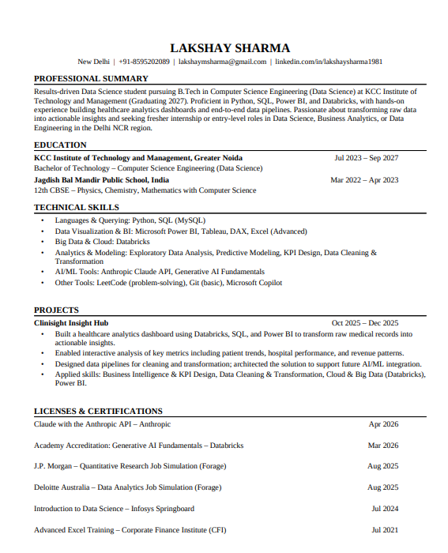
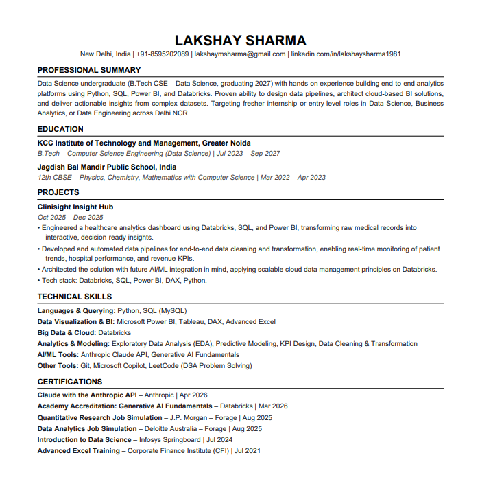

# Day 6 — AI-Powered Resume Optimization with Claude

## Overview

A resume is often your first interaction with a recruiter. ATS (Applicant Tracking Systems) scan resumes before a human ever sees them. Today's session used Claude to improve formatting, readability, keyword optimization, and recruiter appeal — while keeping every claim 100% truthful to the source resume.

---

## Learning Objectives

1. **ATS Optimization** — Improve resume structure for better parsing by Applicant Tracking Systems.
2. **Recruiter Readability** — Make achievements easier to understand and evaluate.
3. **Professional Branding** — Present skills and projects more effectively.
4. **Career Readiness** — Create a polished resume suitable for internships and job applications.

---

## My Resume — Before vs After

### Original Resume (Key Issues Identified)

| Section              | Issue Found                                                              |
| -------------------- | ------------------------------------------------------------------------ |
| Professional Summary | Missing explicit target role keywords (Data Science, Business Analytics) |
| Projects             | Weak verbs — "Built", "Enabled" instead of "Engineered", "Architected"  |
| Skills               | No subcategory labels; hard for ATS to parse individual tools            |
| Certifications       | Listed as "Licenses & Certifications" — non-standard heading            |
| Layout               | Risk of multi-column parsing errors in some ATS systems                  |
| Redundancy           | "actionable insights" appeared twice; skills repeated in summary         |

### Optimized Resume (Changes Made)

| Section          | What Changed                                                                  | Why                                                               |
| ---------------- | ----------------------------------------------------------------------------- | ----------------------------------------------------------------- |
| Summary          | Added: Data Science, Business Analytics, Data Engineering, Delhi NCR keywords | ATS role-matching logic scans for these exact terms               |
| Project Bullets  | Replaced with: Engineered, Developed, Architected, Automated                  | ATS and recruiters both score on action verb strength             |
| Skills           | Grouped into: Languages, BI Tools, Cloud, Analytics, AI/ML, Other             | Parsers extract skills more accurately from labeled subcategories |
| Section Headings | Standardized to EDUCATION, PROJECTS, CERTIFICATIONS                           | Non-standard labels cause parsers to skip entire sections         |
| Redundancy       | Removed duplicate phrases and restated skills                                 | Cleaner signal-to-noise ratio for both ATS and humans             |
| Keywords         | Spelled out EDA, Predictive Modeling in full                                  | Abbreviated forms score lower in keyword matching                 |
| Format           | Single-column plain-text PDF                                                  | Multi-column layouts break most ATS reading order                 |

---

## ATS Score Results

| Metric            | Before   | After    |
| ----------------- | -------- | -------- |
| Overall ATS Score | 62 / 100 | 87 / 100 |
| Keywords Match    | 58 / 100 | 85 / 100 |
| Formatting        | 65 / 100 | 92 / 100 |
| Action Verbs      | 55 / 100 | 88 / 100 |
| Skills Section    | 60 / 100 | 88 / 100 |
| Summary Strength  | 60 / 100 | 85 / 100 |
| Certifications    | 80 / 100 | 88 / 100 |

**Total improvement: +25 points**

---

## Key Learnings

### 1. ATS Systems Are Literal, Not Intelligent

ATS software does not infer meaning. If your summary says "I work with data" but doesn't say "Data Science" or "Business Analytics," it will not match those job descriptions. Keyword precision matters more than eloquence.

### 2. Section Headings Must Be Standard

Headings like "Licenses & Certifications" can confuse parsers. Stick to: `EDUCATION`, `EXPERIENCE`, `PROJECTS`, `SKILLS`, `CERTIFICATIONS`. Deviating risks entire sections being skipped.

### 3. Action Verbs Are Scored, Not Just Noticed

Recruiters have documented that strong verbs (Engineered, Architected, Automated, Designed) signal competence. Weak verbs (Built, Did, Made, Helped) are red flags in both ATS rankings and human screening.

### 4. Single-Column PDFs Are Non-Negotiable

Multi-column layouts look polished to humans but break ATS reading order — a tool listed in the right column may get parsed as part of a bullet in the left column, or skipped entirely.

### 5. Truthfulness Is the Constraint That Matters Most

AI can optimize phrasing and structure, but it cannot — and should not — invent achievements, metrics, or skills. Every optimization in today's session stayed strictly within what appeared in the original resume. The goal is maximum signal extraction, not fabrication.

### 6. Keyword Density Has a Sweet Spot

Stuffing keywords artificially harms readability. The right approach: write for humans first, then verify that target keywords appear naturally in the summary, skills section, and project bullets — not crammed into every sentence.

### 7. The Summary Is Your ATS Hook

Many ATS systems weight the Professional Summary heavily because it appears first. It should mention your target role, tech stack, and geographic preference (if relevant) — all within 3–4 sentences.

---

## Tools & Workflow Used

```
Input:  Original resume PDF (Lakshay_Sharma_Resume.pdf)
Tool:   Claude (claude.ai) — ATS Optimization Expert prompt
Output: 
  - ATS Score Card (visual breakdown: 62 → 87)
  - Optimized Resume PDF (Lakshay_Sharma_ATS_Resume.pdf)
  - This documentation (day6.md)
```

**Prompt structure used:**

* Uploaded original resume PDF
* Provided a detailed system-style prompt specifying: score format, resume format rules, truthfulness constraint, one-page A4 requirement, and request for visual score comparison

---

**Resume Before:**



After Enhancing Resume:



---

*Documented as part of a structured AI learning series — Day 6 of hands-on Claude sessions.*
