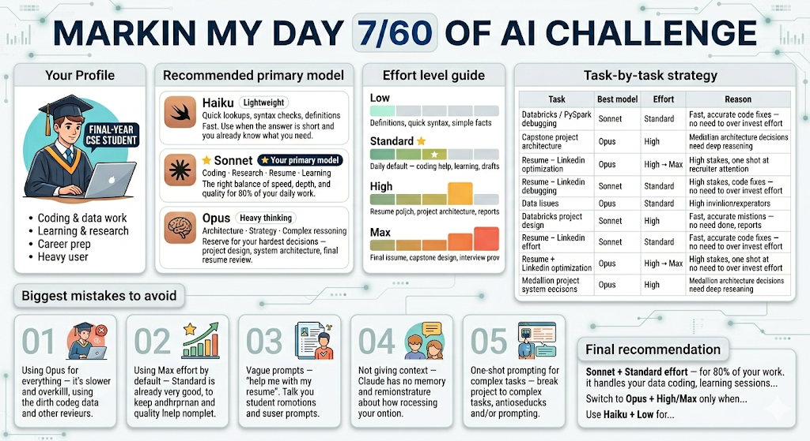

# Day 7 — Claude Model Selection & Reasoning Effort

**Challenge:** 30-Day AI & Claude Learning Challenge
**Date:** June 7, 2025
**Topic:** Claude Model Selection & Reasoning Effort

## What I Learned Today

Today I built a complete, personalized **Claude Usage Strategy** — understanding not just what the models are, but *when* and *why* to use each one based on my actual profile as a final-year CSE (Data Science) student.

### The Three Models — Broken Down

| Model            | Speed      | Depth   | Best For                                                   |
| ---------------- | ---------- | ------- | ---------------------------------------------------------- |
| **Haiku**  | ⚡ Fastest | Basic   | Quick syntax checks, definitions, simple lookups           |
| **Sonnet** | ⚡⚡ Fast  | Deep    | Coding, learning, LinkedIn posts, research — daily driver |
| **Opus**   | 🐢 Slower  | Deepest | Resume review, project architecture, critical decisions    |

### Reasoning Effort Levels

* **Low** — Instant answers for trivial questions (e.g. "what does `.groupby()` return?")
* **Standard** — Default for 80% of work. Great balance of speed and quality.
* **High** — Use when quality matters more than speed (interview prep, research summaries, report drafts)
* **Max** — Reserve for high-stakes, final outputs (capstone submission, resume to recruiter, final project review)

---

## My Personalized Strategy

Based on my profile (CSE student → Data Science, heavy Claude user, focused on coding + career prep + research), here's the framework I'll follow:

### Daily Driver

> **Sonnet + Standard effort** for 80% of tasks

### When to Upgrade

| Situation                            | Model  | Effort      |
| ------------------------------------ | ------ | ----------- |
| Capstone project architecture        | Opus   | High        |
| Final resume / LinkedIn optimization | Opus   | High → Max |
| Interview prep (mock Q&A)            | Sonnet | High        |
| Debugging PySpark / Databricks       | Sonnet | Standard    |
| Research on tools or papers          | Sonnet | High        |
| Quick Python syntax                  | Haiku  | Low         |
| Final project/report review          | Opus   | Max         |

---

## Biggest Mistakes to Avoid

* ❌ Using Opus for everything — overkill for most tasks, slows workflow
* ❌ Defaulting to Max effort — Standard handles 80% of needs well
* ❌ Vague prompts — always include role, goal, and context
* ❌ One-shot prompting for complex work — break it into steps across the conversation
* ❌ Forgetting to paste context — Claude starts fresh every chat

---

## My Workflow Going Forward

```
Morning learning session     → Sonnet + Standard
Databricks / PySpark work    → Sonnet + Standard
LinkedIn post drafting       → Sonnet + Standard
Research / tool exploration  → Sonnet + High
Interview mock prep          → Sonnet + High
Resume / capstone review     → Opus + High or Max
Quick syntax / definitions   → Haiku + Low
```

---

Output by claude in Img format -

---

*Part of my 30-Day Claude AI Challenge | Lakshay | B.Tech CSE (Data Science) @ KCC Institute of Technology & Management*
