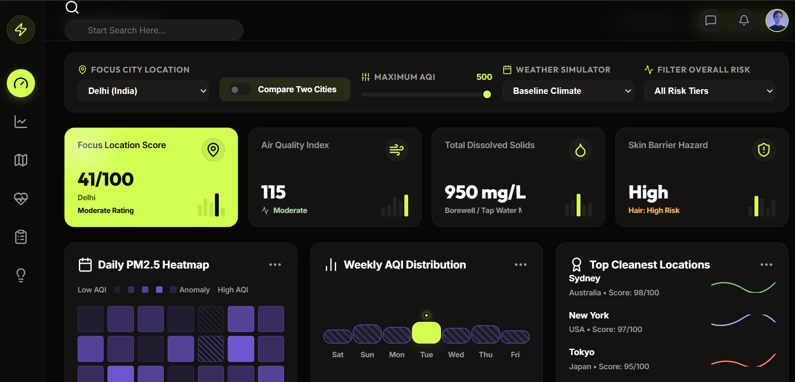
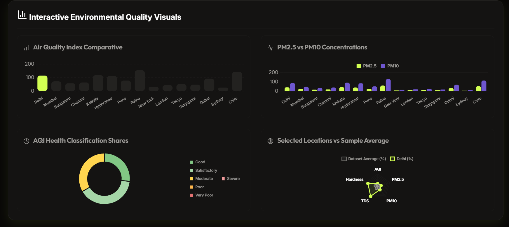
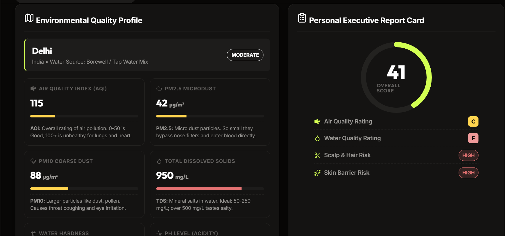

# Day 8 – Build Your First AI-Powered Dashboard

## Objective

Learn how to use Claude Artifacts to generate a fully interactive application instead of a simple text response.

## Project Completed

**Environmental Health Analyzer Dashboard**

Using Claude Artifacts, I generated an interactive dashboard that analyzes environmental health-related data and presents insights through charts, filters, KPI cards, and visual components.

## Features Implemented

* Interactive dashboard interface
* Data visualization charts
* Environmental health metrics
* Dynamic filtering options
* Responsive HTML application
* Downloadable standalone dashboard

## Screenshots

### Dashboard Overview



### Interactive Charts



### Environmental Quality Profile Functionality



> Files Included

* `environmental-health-analyzer.html`
* Dashboard screenshots
* `day8.md`

## What I Learned

### 1. Claude Artifacts

Claude can generate complete applications instead of only providing text responses. This enables rapid prototyping of tools and dashboards.

### 2. Prompt-to-Product Development

A well-structured prompt can be transformed directly into a usable software product.

### 3. Interactive Dashboard Design

Learned how dashboards combine:

* KPI Cards
* Charts and Visualizations
* Filters
* User-friendly layouts

### 4. HTML Application Generation

AI can generate standalone HTML applications that run locally without requiring additional setup.

### 5. Rapid AI-Assisted Development

Using AI significantly reduces development time by automating UI creation, layout design, and application structure.

## Challenges Faced

* Understanding how to structure prompts for application generation.
* Testing dashboard interactions and filters.
* Organizing generated files and screenshots for documentation.

## Key Takeaways

* AI can act as an application builder, not just a chatbot.
* Interactive products can be created with natural language prompts.
* Effective prompting leads to better application quality.
* Claude Artifacts can accelerate prototyping and product development workflows.

## Repository Structure

```text
Day8/
├── day8.md
├── environmental-health-analyzer.html
└── screenshots/
    ├── dashboard-overview.png
    ├── charts.png
    └── filters.png
```

## Conclusion

Day 8 demonstrated how AI can be used to build complete interactive dashboards from prompts. By leveraging Claude Artifacts, I successfully created an Environmental Health Analyzer dashboard and gained practical experience in AI-assisted product development.