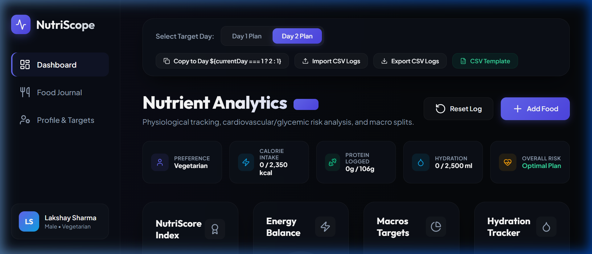
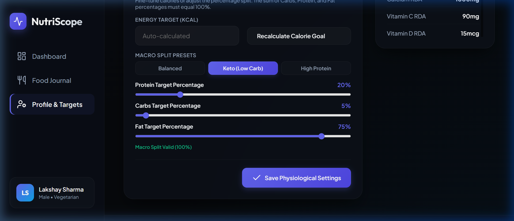
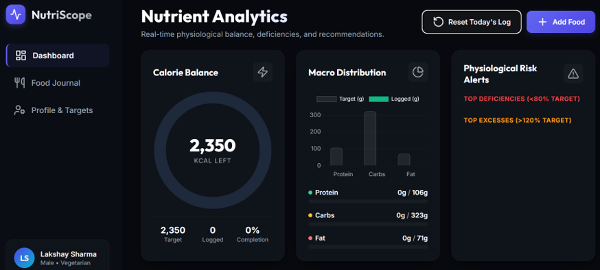

# Day 9 of 60 - #abtalks AI Challenge

**Date:** June 9, 2026
**Project:** NutriScope - Professional Physiological Analytics & Planner (Single-Page Dashboard App)

---

## Daily Topic

> **One of the biggest mistakes beginners make is asking AI to build extremely large applications in a single prompt. Professional AI builders use iterative development: first build a working MVP, then progressively enhance it. This improves reliability, quality, and output consistency.**

---

## Key Learnings from Day 9

1. **Avoid the Single-Prompt Monolith**:
   - Building extremely complex apps in a single prompt exhausts context limits and leads to truncation, syntax errors, and omitted logic.
   - For example, the previous large prompt left several CSS classes completely unstyled (toasts, badge status pills, recommendation container alerts) and skipped essential HTML containers like `deficiencies-list` entirely, causing logical failures.
2. **Iterative Progressive Enhancement**:
   - Starting with a working Minimum Viable Product (MVP) and adding features incrementally allows developer validation at each stage.
   - This phase systematically fixed rendering bugs, restructured grid alignments, and refined design tokens (deep obsidian background, radial glows, glassmorphic filters).
3. **User-Centric Spacing & Simplification**:
   - Large applications risk visual congestion if all settings and tools are thrown onto the screen at once.
   - By migrating the heavy day-switcher bar and CSV import/export utilities into a compact header segmented controller and a dropdown options list, the dashboard regained clean, executive breathing room.
4. **Custom Preset Adaptations**:
   - Developing macros preset calculations (like Balanced, Keto, High Protein) requires matching slider boundaries. Adjusting input range limits in the HTML form from static defaults (e.g. min carbs 20% to min carbs 2%) allowed custom ratios to evaluate successfully without invalid validation alerts.

---

## HTML Application Output

Below are the visual dashboard outcomes verifying the clean presentation, layout balance, and dynamic preset configuration:

### 1. Polished main Dashboard View

Featuring a concise 4-column metrics panel (Health Score, Energy Balance, Macro Targets, Hydration), the newly integrated side-by-side Risk Profiles & Threshold Alerts panel, and the Daily Nutrient table:

### 2. Keto Preset Configurations

Sliders successfully adjust to Protein 20% / Carbs 5% / Fat 75% under the expanded ranges, updating targets dynamically:

old website -
